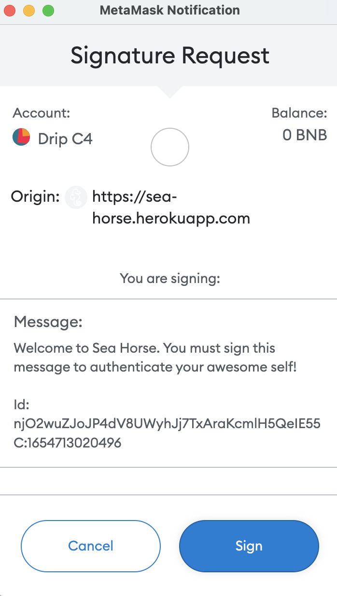
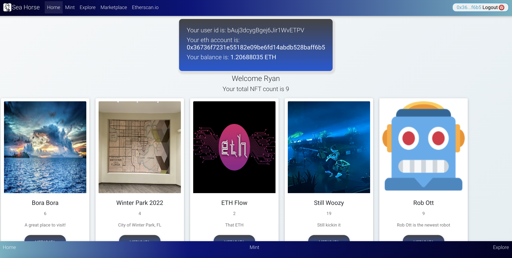
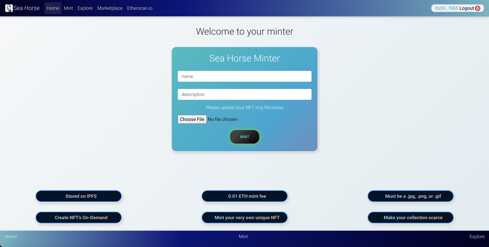
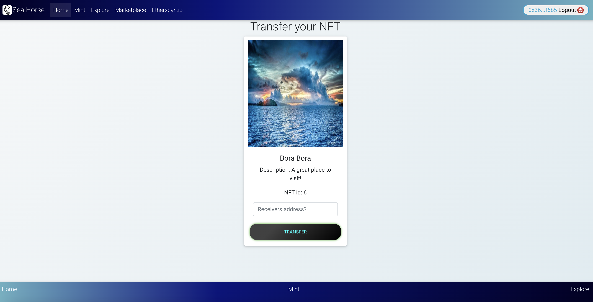

# Sea Horse 

#### A Blockchain NFT Minter Dapp and Owner Dashbord. [Heroku Deployed Here](https://sea-horse.herokuapp.com/)

 

#### ROPSTEN TESTNET CONTRACT ADDRESS:
    0x8e0dFC0785102D94Fec8d4E3BD7Bf84290Da04F5    

### [Contract Address on Etherscan can be found HERE](https://ropsten.etherscan.io/address/0x8e0dFC0785102D94Fec8d4E3BD7Bf84290Da04F5)

 

    
    
    
    
    
     
    
    
    

    
     
    

 

### The purpose of this app is to give anyone the ability to mint their own NFT. (Currently in development on the ROPSTEN TESTNET). 

 

### Tech Stack -

    Moralis, Express.js, React.js, Node.js, Solidity

### Home Page

    

 
 

### Metamask Authentication

    

 
 

### Home Page Logged In

    

 
 

### Mint Page

    

 
 

### Transfer Page

    

 
 

### Root File Structure
    📦sea-horse
    ┣ 📂assets
    ┃ ┣ 📜explore-page.png
    ┃ ┣ 📜home-page-logged-in.png
    ┃ ┣ 📜home-page.png
    ┃ ┣ 📜marketplace-page.png
    ┃ ┣ 📜metamask-authentication.png
    ┃ ┣ 📜mint-page.png
    ┃ ┗ 📜transfer-page.png
    ┣ 📂build
    ┃ ┣ 📜asset-manifest.json
    ┃ ┣ 📜favicon.ico
    ┃ ┣ 📜index.html
    ┃ ┣ 📜logo192.png
    ┃ ┣ 📜logo512.png
    ┃ ┣ 📜manifest.json
    ┃ ┗ 📜robots.txt
    ┣ 📂contracts
    ┃ ┣ 📜Greeter.sol
    ┃ ┣ 📜SeaHorse.sol
    ┃ ┗ 📜ryanNft.sol
    ┣ 📂public
    ┃ ┣ 📜favicon.ico
    ┃ ┣ 📜index.html
    ┃ ┣ 📜logo192.png
    ┃ ┣ 📜logo512.png
    ┃ ┣ 📜manifest.json
    ┃ ┗ 📜robots.txt
    ┣ 📂scripts
    ┃ ┗ 📜sample-script.js
    ┣ 📂src
    ┃ ┣ 📂abi
    ┃ ┃ ┗ 📜abi.js
    ┃ ┣ 📂components
    ┃ ┃ ┣ 📜404.js
    ┃ ┃ ┣ 📜Cards.js
    ┃ ┃ ┣ 📜Explore.js
    ┃ ┃ ┣ 📜Footer.js
    ┃ ┃ ┣ 📜Home.js
    ┃ ┃ ┣ 📜Marketplace.js
    ┃ ┃ ┣ 📜Mint.js
    ┃ ┃ ┣ 📜MintFees.js
    ┃ ┃ ┣ 📜Navbar.js
    ┃ ┃ ┣ 📜Spinner.js
    ┃ ┃ ┣ 📜Transfer.js
    ┃ ┃ ┗ 📜Welcome.js
    ┃ ┣ 📂context
    ┃ ┃ ┗ 📜context.js
    ┃ ┣ 📂logo
    ┃ ┃ ┗ 📜seahorse.jpg
    ┃ ┣ 📜.DS_Store
    ┃ ┣ 📜App.css
    ┃ ┣ 📜App.js
    ┃ ┣ 📜App.test.js
    ┃ ┣ 📜index.css
    ┃ ┣ 📜index.js
    ┃ ┣ 📜logo.svg
    ┃ ┣ 📜reportWebVitals.js
    ┃ ┗ 📜setupTests.js
    ┣ 📂test
    ┃ ┗ 📜sample-test.js
    ┣ 📜.env
    ┣ 📜.gitignore
    ┣ 📜LICENSE
    ┣ 📜Procfile
    ┣ 📜README.md
    ┣ 📜READMEHARDHAT.md
    ┣ 📜config-overrides.js
    ┣ 📜hardhat.config.js
    ┣ 📜package-lock.json
    ┣ 📜package.json
    ┗ 📜server.js

